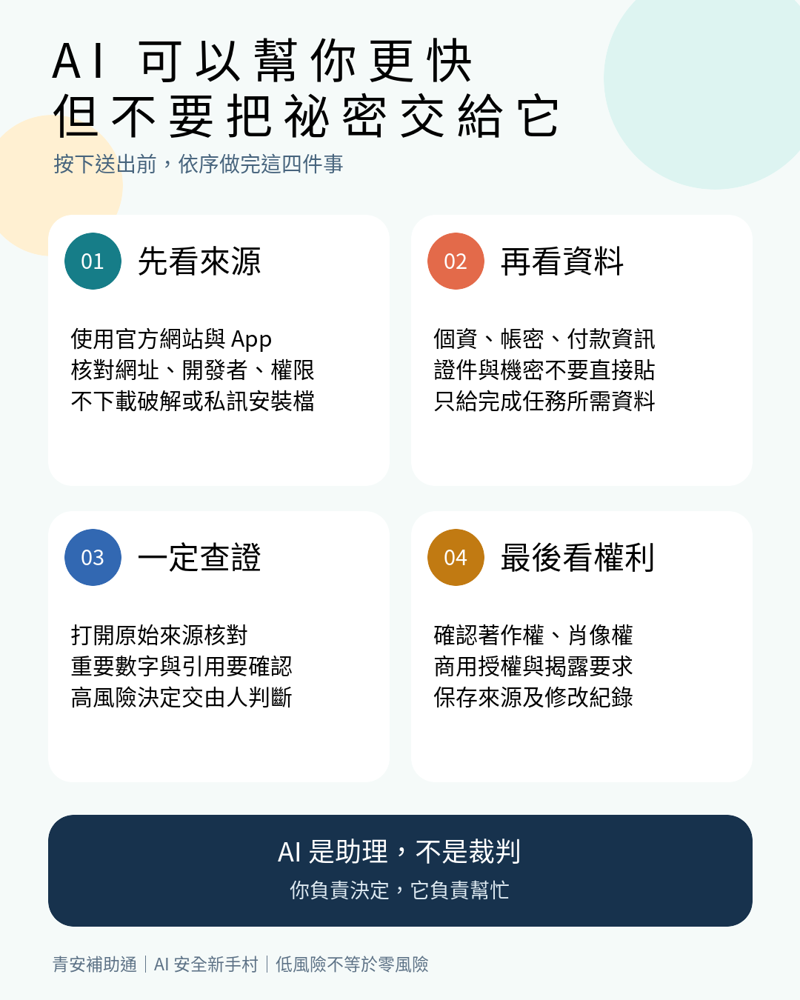
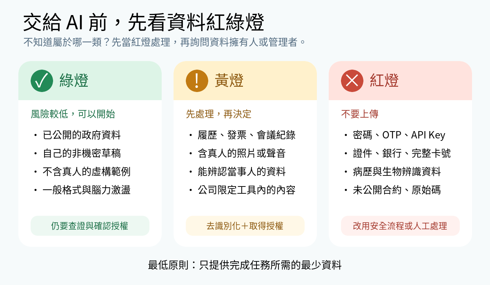
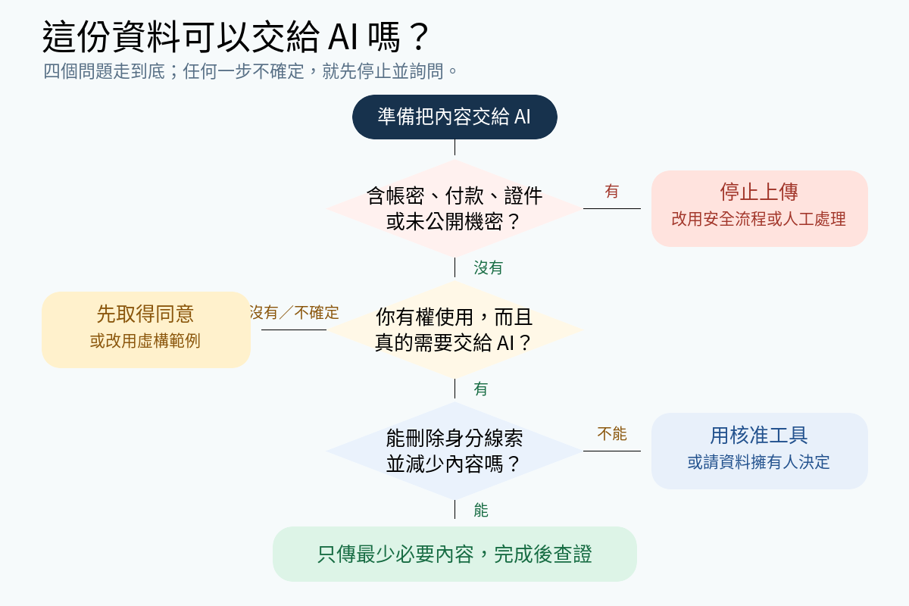
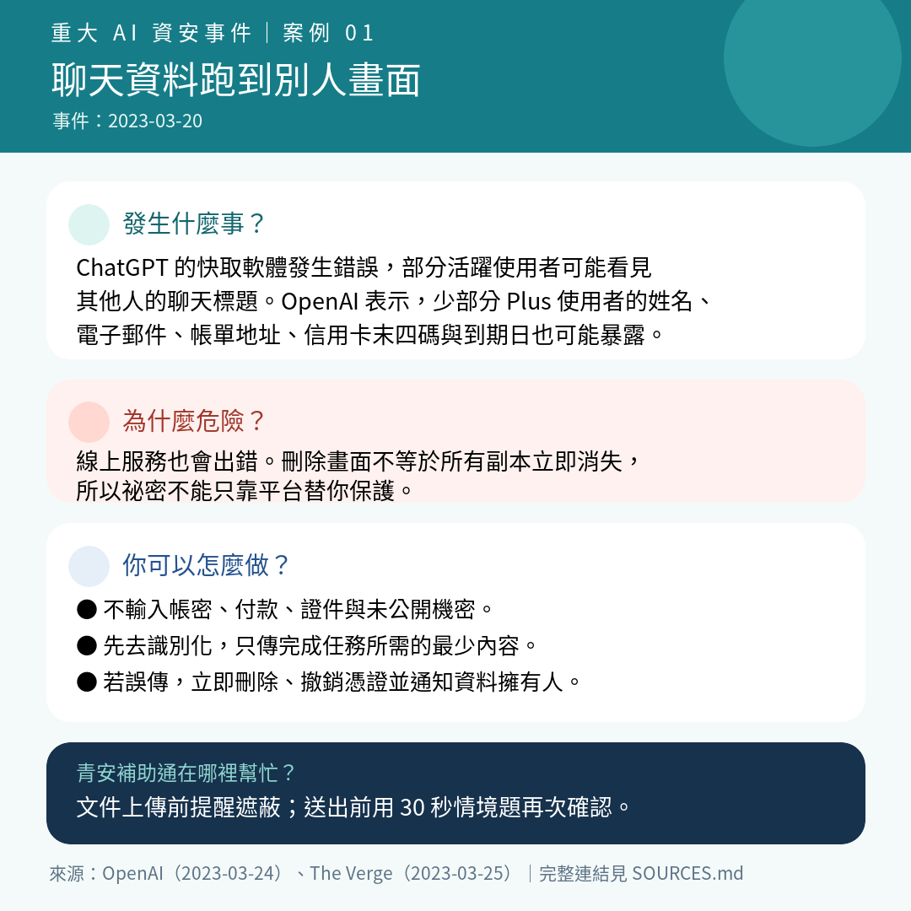
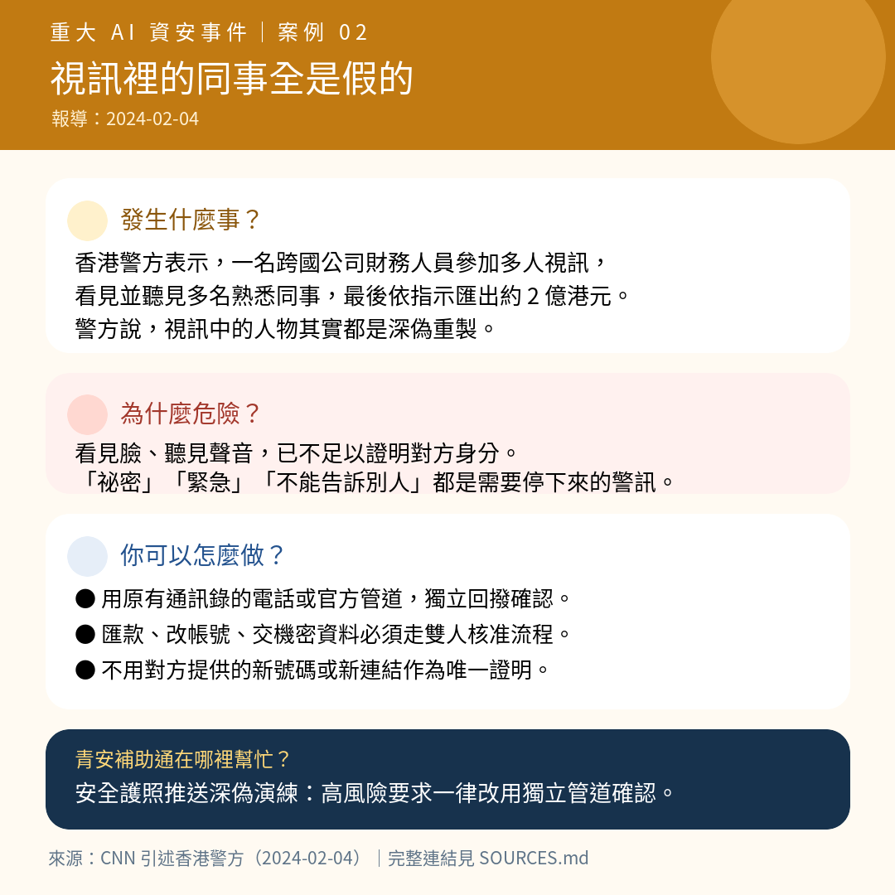
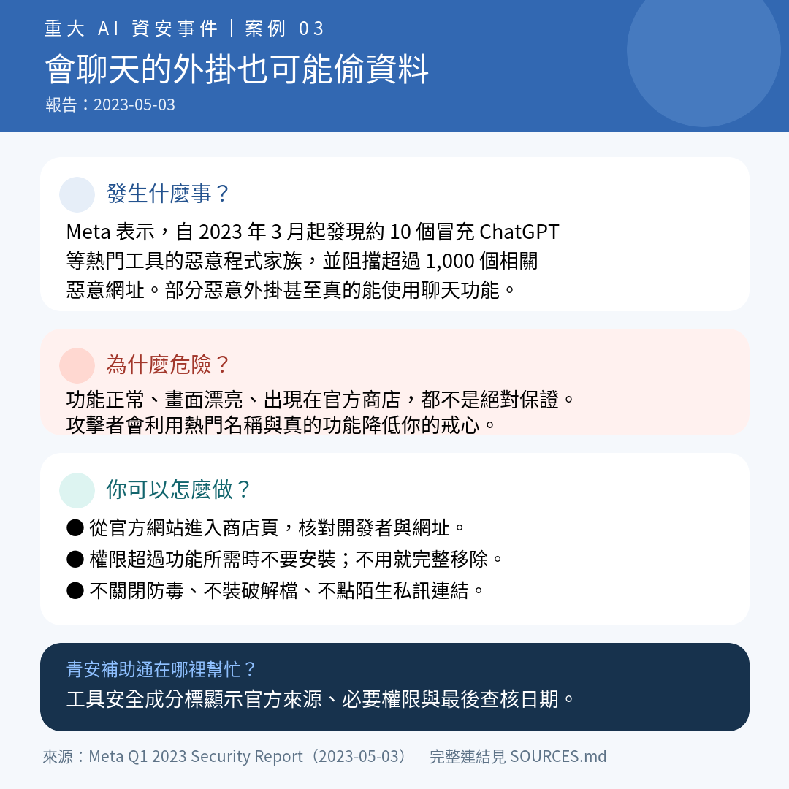

# AI 安全使用懶人包


> **AI 可以幫你更快，但不要把祕密交給它。**

這是一份給 AI 新手的 10 分鐘安全教學。不用懂程式，也不用背資安術語。只要記住四個動作：

> **先看來源 → 再看資料 → 一定查證 → 最後看權利**


---

## 先記住三件事

把 AI 想成一位**速度很快、記性不一定可靠，而且工作地點不一定由你控制的助理**：

1. **你交給它的資料，可能會被服務商保存或處理。** 不要預設聊天內容只有你看得到。
2. **它講得很有自信，也可能講錯。** 語氣像答案，不等於真的有根據。
3. **熱門 AI 工具常被壞人冒充。** 能正常回答問題的外掛，也可能同時偷帳號或瀏覽資料。



---

## 第一步：先看來源

### 你要做什麼？

- 從工具的**官方網站、官方 App 商店頁面或政府提供的連結**進入。
- 核對開發者名稱、網址拼字、下載數與要求的權限。
- 不下載「破解版」「免費解鎖版」或別人私訊給你的安裝檔。
- 瀏覽器外掛若要求「讀取及變更你在所有網站上的資料」，先停下來確認它真的需要這項權限。

### 看到這些訊號，先不要裝

- 網址只差一個字母，或使用奇怪的短網址。
- 要你關閉防毒軟體才能安裝。
- 承諾「永久免費」「保證不留紀錄」「百分之百正確」。
- 明明只是聊天工具，卻要求讀取相簿、通訊錄、所有網頁或系統管理權限。

> **新手規則：** 不知道是不是官方來源，就先不要登入、下載或付款。

---

## 第二步：再看資料

按下送出前，先問自己：

> **如果這段內容明天被貼在公開網路上，我承受得了嗎？**



### 紅燈：不要上傳

- 密碼、一次性驗證碼（OTP）、API Key、登入連結。
- 身分證字號、護照、完整生日、住址與可識別個人的證件影像。
- 信用卡完整卡號、安全碼、銀行登入資訊與未遮蔽的付款資料。
- 病歷、諮商紀錄、生物辨識資料。
- 未公開合約、客戶名單、原始碼、營運數字或公司內部文件。
- 任何你沒有權利替別人公開的資料。

### 黃燈：先處理，再決定

- 履歷、發票、會議紀錄、照片、研究資料。
- 已取得同意，但仍能辨認當事人的內容。
- 公司允許使用，但只限指定企業工具或指定帳號的資料。

先做三件事：**刪除不必要欄位、換成假名或代號、只留下完成任務所需的最少內容**。這叫做「去識別化」和「資料最小化」。

### 綠燈：風險較低，但仍要查證

- 已公開且確認可引用的政府資料。
- 你自己寫的非機密草稿。
- 不包含真實人物或真實公司的虛構範例。
- 一般格式、腦力激盪與不涉及個資的問題。

「綠燈」只表示資料外洩風險較低，不代表答案一定正確或素材一定能商用。



---

## 第三步：一定查證

AI 最危險的地方，不一定是它明顯亂講，而是它把錯誤說得很像真的。

### 依風險選擇查證方式

| 使用情境 | 最少要做的查證 |
|---|---|
| 想標題、改語氣 | 自己重讀，確認沒有改變原意 |
| 查補助資格、期限 | 回到政府公告或承辦單位確認 |
| 引用數字、新聞、論文 | 打開原始來源，核對作者、日期與內容 |
| 產生程式碼 | 在隔離或測試環境執行，檢查依賴與權限 |
| 醫療、法律、財務決策 | 查官方資訊，並諮詢具資格的專業人員 |
| 收到匯款或保密指示 | 用原本就知道的電話或管道，向本人再次確認 |

### 三秒鐘自問

1. 它有沒有提供我真的打得開的來源？
2. 原始來源真的支持這個結論嗎？
3. 如果答案錯了，會不會害人、損失錢或洩漏資料？

第三題只要回答「會」，就不能只相信 AI。

---

## 第四步：最後看權利

「AI 做的」不等於「自動可以公開或商用」。送出作品前檢查：

- **著作權與授權：** 你使用的圖片、音樂、字型、程式碼與資料是否允許這種用途？
- **肖像與聲音：** 有真人的臉、聲音或可辨識特徵時，是否取得同意？
- **工具條款：** 免費版、學生版與商業版的輸入、輸出及商用條件可能不同。
- **揭露要求：** 比賽、學校、公司或平台是否要求標示使用 AI？
- **最終責任：** 發布前由人檢查，不把侵權、歧視或不實內容的責任推給工具。

> **簡單做法：** 保存素材來源、授權頁面、工具版本、提示詞與人工修改紀錄。

---

## 四個生活例子

### 1. 用 AI 修改履歷

**不安全：** 直接貼上含姓名、電話、地址、身分證字號、推薦人電話的完整履歷。

**較安全：**

1. 複製一份履歷草稿。
2. 把姓名改成「求職者 A」，公司改成「某科技公司」。
3. 刪除電話、地址、證件、生日與推薦人資料。
4. 只提供要改善的段落與目標職缺能力。

範例提示詞：

```text
請幫我把以下三點工作經驗改寫得更具體，每點不超過 45 字。
內容已移除姓名、公司名稱、聯絡方式與未公開資料。
不要新增我沒有提供的成果或數字。
```

### 2. 用 AI 整理發票或補助文件

**不安全：** 把含完整卡號、地址、會員編號或其他購買人的文件丟進公開 AI。

**較安全：** 使用政府指定的安全上傳頁面；只遮蔽審查不需要的付款與會員資料。若不確定哪些欄位可遮蔽，先詢問承辦人，不要自行改動審查必要資訊。

### 3. 用 AI 生成海報或影片

**不安全：** 未經同意模仿真實人物的臉或聲音，或直接使用來源不明的素材。

**較安全：** 使用自己創作、取得授權或明確可用的素材；保留授權紀錄；發布前檢查是否需要標示 AI 參與。

### 4. 用 AI 整理公司文件

**不安全：** 把未公開合約、客戶名單、程式碼或財務數字貼進個人 AI 帳號。

**較安全：** 先遵守公司政策。只有在公司核准的工具、帳號和資料範圍內使用；仍應只提供最少必要內容。

---

## 帳號、外掛與裝置也要安全

- AI 帳號使用獨立長密碼，能開啟多因素驗證就開啟。
- 不把工作帳號借給別人，不共用登入連結或驗證碼。
- 定期檢查已連接的雲端硬碟、郵件、行事曆與外掛權限。
- 不再使用的外掛要移除，不只關閉。
- 系統、瀏覽器與 App 保持更新。
- AI 要代你寄信、刪檔、購物或轉帳時，必須先顯示將執行的動作，並由你確認。

---

## 如果已經把不該給的資料傳出去了

先冷靜，照順序處理：

1. **停止：** 不再補傳資料，也不要把事件轉傳給更多人。
2. **保留必要證據：** 記下時間、工具、帳號、傳了什麼與已採取的動作；不要為了截圖再次暴露機密。
3. **刪除與撤銷：** 使用服務提供的刪除功能，並撤銷分享連結、外掛與連線權限。刪除畫面不代表所有副本一定立即消失。
4. **更換憑證：** 若包含密碼、API Key、驗證碼或付款資料，立即更換或撤銷；付款資料應同步聯絡金融機構。
5. **通知與求助：** 儘快告知資料擁有人、公司資安／主管、承辦機關或適當的官方通報管道，不要隱瞞到問題擴大。

---

## 三個真的發生過的事件

### 案例一：AI 服務錯誤，讓別人的資料出現在你眼前



2023 年 3 月 20 日，ChatGPT 因快取軟體錯誤，部分使用者可能看見其他人的聊天標題；少部分活躍 Plus 使用者的姓名、電子郵件、帳單地址、信用卡末四碼與到期日也可能暴露。重點不是「某個工具一定不安全」，而是**任何線上服務都可能發生錯誤，所以祕密不該只靠服務商替你保護**。

### 案例二：視訊裡每個熟面孔，都可能是假的



2024 年 2 月，香港警方說明一名跨國公司財務人員在視訊會議中，看見和聽見多名熟悉同事，最後依指示匯出約 2 億港元；警方表示會議中的人物是深偽重製。**看見臉、聽見聲音，不再足以證明對方身分。**

### 案例三：會聊天的外掛，也可能同時偷資料



Meta 在 2023 年 5 月報告，自同年 3 月起發現約 10 個冒充 ChatGPT 等工具的惡意程式家族，並封鎖超過 1,000 個相關惡意網址。部分惡意瀏覽器外掛甚至真的能使用 ChatGPT 功能，藉此降低使用者戒心。

完整事件來源與數字定義請見 [SOURCES.md](SOURCES.md)。

---

## 30 秒風險演練

### 第 1 題：履歷

你要請 AI 改履歷，哪一份最適合使用？

- A. 含姓名、住址、電話和身分證字號的原始履歷
- B. 已移除個資、公司機密與推薦人資料的工作經驗段落
- C. 同事的完整履歷，因為不是自己的資料

<details>
<summary>查看答案</summary>

**答案：B。** A 含有不必要個資；C 的資料仍屬於同事，不能因為不是自己的就任意上傳。

</details>

### 第 2 題：緊急匯款

主管在視訊中要求你立刻祕密匯款，你應先做什麼？

- A. 看到主管的臉就立刻匯款
- B. 用公司原有通訊錄中的電話或核准流程，再次確認
- C. 請視訊中的主管多說幾句話

<details>
<summary>查看答案</summary>

**答案：B。** 深偽可以模仿臉和聲音。高風險動作必須改用獨立管道確認，並遵守雙人或分級核准流程。

</details>

### 第 3 題：瀏覽器外掛

一個 AI 外掛真的能回答問題，但要求讀取你在所有網站上的資料，代表什麼？

- A. 能用就代表安全
- B. 在官方商店就不需要檢查
- C. 功能正常不代表沒有惡意行為，應確認開發者與必要權限

<details>
<summary>查看答案</summary>

**答案：C。** 惡意外掛可能同時提供正常功能。官方商店能降低風險，但不能取代權限與開發者檢查。

</details>

### 第 4 題：AI 提供的資料來源

AI 列出三篇看似完整的論文，你下一步應該：

- A. 因為格式完整，所以直接引用
- B. 打開原始來源，確認論文存在且真的支持該說法
- C. 再問同一個 AI 一次，只要答案相同就可信

<details>
<summary>查看答案</summary>

**答案：B。** AI 可能捏造不存在的標題、作者或網址。重複問同一系統不等於獨立查證。

</details>

### 第 5 題：AI 生成宣傳圖

你用 AI 生成一張很像知名藝人的商業海報，最安全的處理是：

- A. AI 生成的圖不需要管權利
- B. 先確認肖像、素材、工具商用條款與揭露要求，沒有權利就更換設計
- C. 加上「僅供參考」就能直接商用

<details>
<summary>查看答案</summary>

**答案：B。** 工具產生內容不會自動替你取得肖像、著作或商用權利。

</details>

---

## 送出前 60 秒檢查卡

- [ ] 我從官方來源進入工具，沒有使用破解程式或可疑外掛。
- [ ] 我沒有提供密碼、驗證碼、付款資料、證件或未公開機密。
- [ ] 我已刪除不必要個資，只提供完成任務所需的最少內容。
- [ ] 我已確認帳號、雲端硬碟、郵件與外掛權限。
- [ ] 我已打開原始來源，查證重要事實、數字與引用。
- [ ] 高風險決定有由本人、官方單位或合格專業人員確認。
- [ ] 我有權使用輸入素材，並確認輸出內容的商用與揭露要求。
- [ ] 發布或送出前，已由人完成最後檢查。

> **最後一句：AI 是助理，不是裁判；你負責決定，它負責幫忙。**


---

## 下載與分享圖卡

每張圖都提供可直接分享的 PNG，以及可繼續排版編輯的 SVG：

- 一頁式懶人包：[PNG](assets/ai-safety-one-page.png)｜[SVG](assets/ai-safety-one-page.svg)
- 資料紅綠燈：[PNG](assets/data-traffic-light.png)｜[SVG](assets/data-traffic-light.svg)
- 資料判斷流程：[PNG](assets/data-decision-flow.png)｜[SVG](assets/data-decision-flow.svg)
- 案例一，ChatGPT 資料暴露：[PNG](assets/case-chatgpt-data-exposure.png)｜[SVG](assets/case-chatgpt-data-exposure.svg)
- 案例二，多人深偽視訊詐騙：[PNG](assets/case-deepfake-fraud.png)｜[SVG](assets/case-deepfake-fraud.svg)
- 案例三，假 AI 工具與惡意外掛：[PNG](assets/case-fake-ai-malware.png)｜[SVG](assets/case-fake-ai-malware.svg)

---

## 教材資訊

- 語言：繁體中文（臺灣）
- 對象：18–40 歲、沒有資安背景的 AI 工具使用者
- 版本：1.0
- 更新日期：2026-08-15
- 依據：[政府題目.pdf](../政府題目.pdf)、[政府題目_完整解題方案.md](../政府題目_完整解題方案.md)
- 來源與查核紀錄：[SOURCES.md](SOURCES.md)
